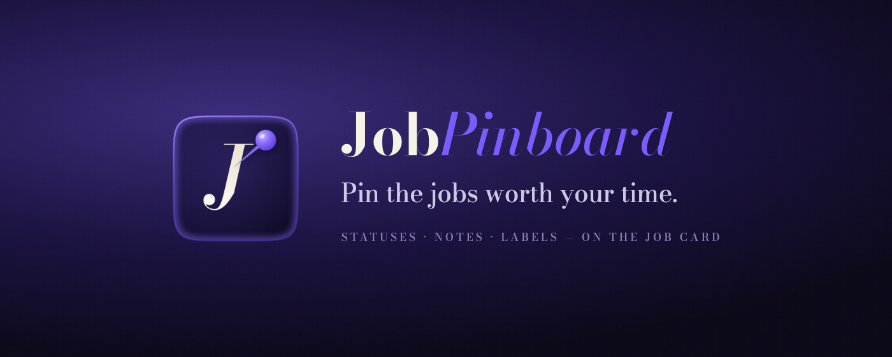

  

<h1 align="center">JobPinboard</h1>

  <em>Pin the jobs worth your time.</em> 
  <a href="https://jobpinboard.com">jobpinboard.com</a> ·
  <a href="https://jobpinboard.com/support">Support</a> ·
  <a href="https://jobpinboard.com/privacy.html">Privacy</a>

---

**This repository contains no source code.** It is the public issue tracker for
JobPinboard, a Chrome extension for managing job hunting on LinkedIn. Bugs, feature
requests and questions belong in [**Issues**](../../issues) — everything else about the
product lives at [jobpinboard.com](https://jobpinboard.com).

## What JobPinboard does

JobPinboard turns LinkedIn Jobs into a workspace you can actually manage. You set a status,
jot a note, or tag a role with a colour label — right on the job card, without leaving the
search results. No second tab, no spreadsheet, no account.

- **Status at a glance** — mark a job Applied, Saved, Interview or Rejected. Untouched cards
  stay exactly as LinkedIn drew them.
- **Notes on the card** — "recruiter said Q3 start", "salary was vague". Autosaves as you type.
- **Colour labels** — "Dream role", "Remote only", whatever you need. Created inline.
- **Hide the noise** — dismiss a job you've ruled out, with a 5-second undo.
- **Filter the live list** — by status, label, or a text search over title and company.
- **Dashboard** — counts by status, search across everything you've tracked, tap-to-filter tiles.
- **Keyboard triage** — `J`/`K` to move, single keys to set status, label, note or hide.
  Built for working through 300 jobs, not 3.
- **Backup and restore** — export to JSON, import on another machine.

**Install:** [jobpinboard.com](https://jobpinboard.com) → *Add to Chrome*. Free.

## Privacy, briefly

The extension makes **no network requests of any kind**. Your statuses, notes and labels are
written to your browser's own storage on your own device — there is no server, no account, no
sign-up, no analytics. It also never automates LinkedIn: it does not apply, connect, message
or click anything on your behalf. It only annotates what is already on the page.

Full details: [privacy policy](https://jobpinboard.com/privacy.html).

## Before you open an issue

Four things account for most reports:

<strong>The controls aren't appearing on job cards</strong>

Reload the LinkedIn tab. If they still don't appear, check that JobPinboard is enabled at
`chrome://extensions`, and confirm you're on a jobs page — the extension is deliberately
inert everywhere else on LinkedIn, including the feed, messaging and profiles.

<strong>My statuses and notes disappeared</strong>

Your data lives in this browser profile only. Clearing browsing data with "hosted app data"
or "cookies and other site data" ticked removes it, as does removing and reinstalling the
extension. If you have a backup JSON file, import it from the toolbar popup. Export
regularly — it's the only recovery path, by design.

<strong>It works on some LinkedIn pages but not others</strong>

JobPinboard annotates LinkedIn's job list surfaces — search results, recommended jobs and
collections. If a jobs page you expect to work doesn't, that's worth reporting: tell us the
URL pattern (e.g. `/jobs/collections/recommended/`), not the full link.

<strong>I want my data on another machine</strong>

Open the toolbar popup, export to JSON, move the file across, and import it on the other
machine. Importing shows you a preview before it writes anything, and merges rather than
overwrites.

Then [**search existing issues**](../../issues?q=is%3Aissue) — if your problem is already
there, add a 👍 rather than opening a duplicate. Reactions are how work gets prioritised.

## Opening an issue

| If | Then |
|---|---|
| 🐛 Something is broken | [**Report a bug**](../../issues/new?template=bug_report.yml) |
| 💡 Something is missing | [**Request a feature**](../../issues/new?template=feature_request.yml) |
| 🔒 Anything private, personal or account-related | [the private contact form](https://jobpinboard.com/support#contact) |
| 🕵️ Privacy or data questions | [privacy@jobpinboard.com](mailto:privacy@jobpinboard.com) |

> [!IMPORTANT]
> **Issues here are public and permanently indexed by search engines.** A job search is
> nobody else's business — including ours. Before you attach a screenshot, crop or redact
> the job titles, company names, recruiter names and your own LinkedIn identity. A screenshot
> of the *broken control* is what helps; the surrounding job list is not. If a report can't
> be made without your private details in it, use the
> [private contact form](https://jobpinboard.com/support#contact) instead.

## What to expect

JobPinboard is made by one person. Issues get read, and usually get a reply within two
working days. Bugs that break the core loop — annotating, saving, filtering — jump the
queue. Feature requests are genuinely welcome, but the product's guiding constraint is that
it must reduce cognitive load, never add to it, so "no, and here's why" is a real possible
answer.

---

Not affiliated with, endorsed by, or sponsored by LinkedIn Corporation. LinkedIn is a
trademark of LinkedIn Corporation.
